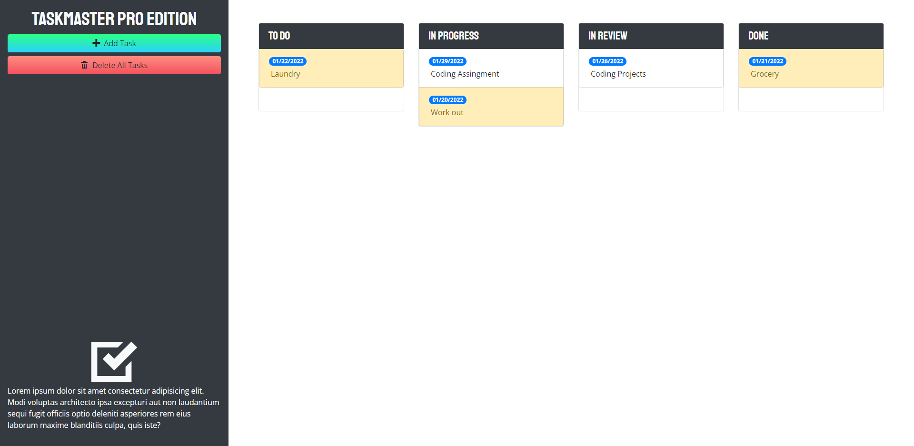

<h1>Taskmaster Pro</h1>
    
This repo houses the codes used to build code Taskmaster Pro application, available at https://khklee.github.io/taskmaster-pro/. 

<h3>Website Description</h3>
    
Taskmaster Pro is a task managing application that allows a user to save and arrange tasks to do. When a user adds task, he/she can arrange it in four different sections, 'to do', 'in progress', 'in review', or 'done' by dragging a task. If a task is due in 3 days or past, it will be highlighted in colors. Tasks can be deleted by dragging to the bottom or clicking 'Delete All Tasks' buttons. Date on tasks can be also edtied by clicking it.

<h3>Website Screenshot</h3>
    